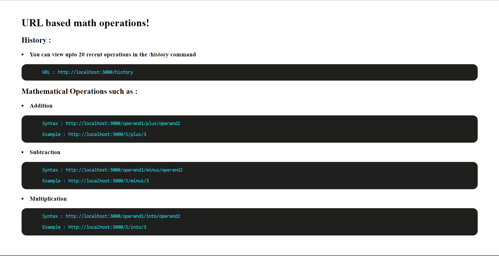

# Mathematical Operations Server

This is a simple Python-based server that responds to mathematical operations sent via URLs. It also maintains a history of the last 20 operations performed on the server. The server is built using the Flask framework.

## Features

- Supports basic mathematical operations: addition, subtraction, multiplication.
- Maintains a history of the last 20 operations performed.
- History is preserved even after a server restart.

## Prerequisites

- python3.x
- flask
- collections
- json

## Run this for installing packages!
<pre><code>pip install requirements.txt</code></pre>

## Run the server
<pre><code>python main-server.py</code></pre>

## Screenshots
